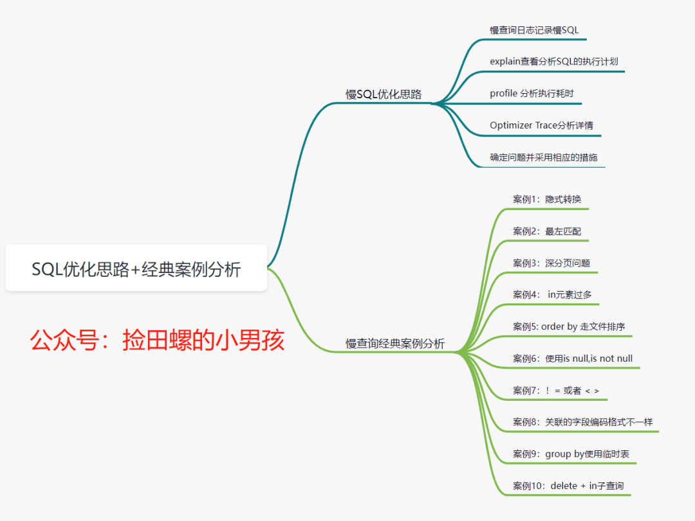
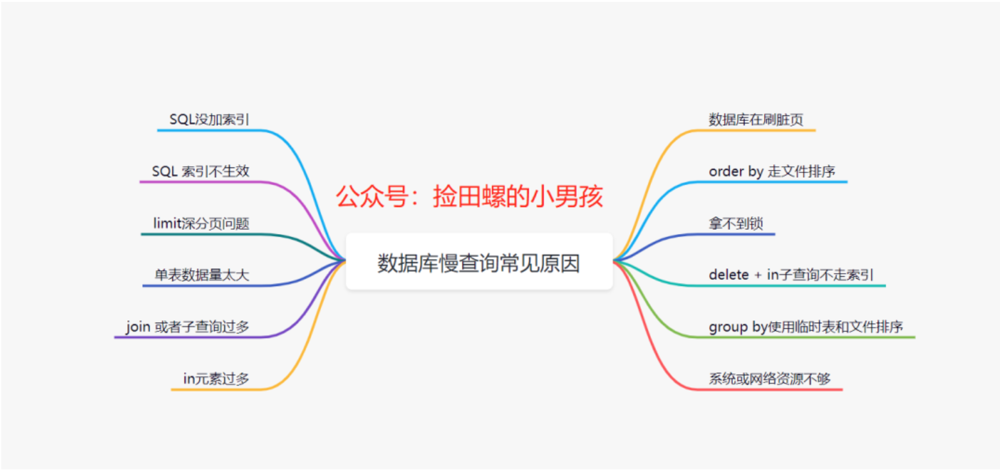
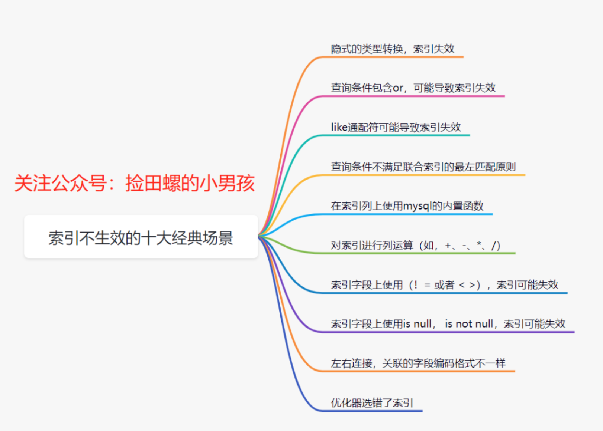

- SQL优化思路+经典案例分析  
  https://mp.weixin.qq.com/s/BbrLQWGYlkXiy6t4YANj0Q
  
  
- 盘点MySQL慢查询的12个原因  
  https://mp.weixin.qq.com/s/gz-wQPsaerf4k7ymG8DiDA
  
  

- 生产问题分析！delete in子查询不走索引？！  
  https://mp.weixin.qq.com/s?__biz=Mzg3NzU5NTIwNg==&mid=2247495170&idx=1&sn=ce914de3abdb0d887e286b680b25111f&chksm=cf22312bf855b83d31a00da110626747df8e69fca1bc310642c56e39d663b006a8105f9fb1e1&token=1627163936&lang=zh_CN&scene=21#wechat_redirect
  
- 实战！聊聊如何解决MySQL深分页问题   
  https://mp.weixin.qq.com/s?__biz=Mzg3NzU5NTIwNg==&mid=2247495139&idx=1&sn=9dd98a8e09af48440cc5f01d3aafd87e&chksm=cf2232caf855bbdc4ea538550ecde6c575c91a1d1b1c42f3bc6091c715dde1a4a5e90d3f7ce2&token=1627163936&lang=zh_CN&scene=21#wechat_redirect
 
- 后端程序员必备：书写高质量SQL的30条建议  
  https://mp.weixin.qq.com/s?__biz=Mzg3NzU5NTIwNg==&mid=2247487972&idx=1&sn=cd035a7fcd7496658846ab9f914be2db&chksm=cf21cecdf85647dbc53e212bf1a2b95d0eb2bffe08dc0141e01f8a9b2088abffc385a2ef584e&token=1627163936&lang=zh_CN&scene=21#wechat_redirect
  
- MySQL中，21个写SQL的好习惯（修正版）   
  https://mp.weixin.qq.com/s?__biz=Mzg3NzU5NTIwNg==&mid=2247488085&idx=1&sn=3f6957154a26b9b9e3b8a4ae736fa3e2&chksm=cf21cd7cf856446a1cf0d71c84a0cd1f456b26634c5977cdec0e0c2cea5f4ea4f1ea2835c818&token=1627163936&lang=zh_CN&scene=21#wechat_redirect
  
  
